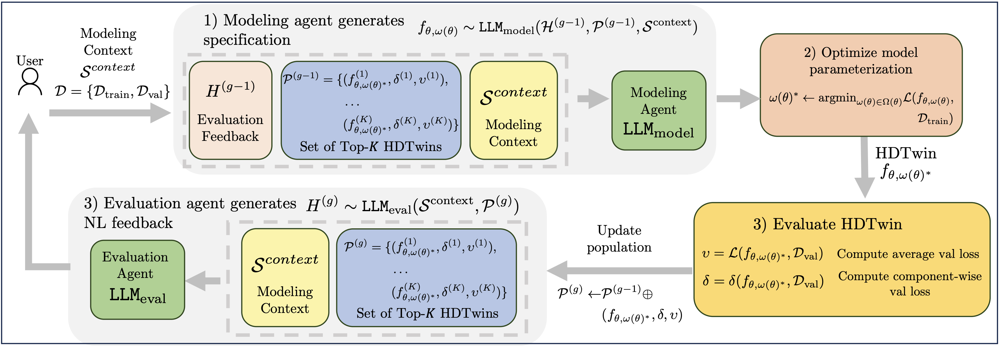

# [NeurIPS 2024 Spotlight] Automatically Learning Hybrid Digital Twins of Dynamical Systems

[](https://openreview.net/forum?id=SOsiObSdU2)
[](https://opensource.org/licenses/MIT)
[](https://github.com/psf/black)

This repo holds the code for [Automatically Learning Hybrid Digital Twins of Dynamical Systems](https://arxiv.org/abs/2410.23691).


#### Introduction

Digital Twins (DTs) are computational models that simulate the states and temporal dynamics of real-world systems, playing a crucial role in prediction, understanding, and decision-making across diverse domains. However, existing approaches to DTs often struggle to generalize to unseen conditions in data-scarce settings, a crucial requirement for such models. To address these limitations, our work begins by establishing the essential desiderata for effective DTs. Hybrid Digital Twins (HDTwins) represent a promising approach to address these requirements, modeling systems using a composition of both mechanistic and neural components. This hybrid architecture simultaneously leverages (partial) domain knowledge and neural network expressiveness to enhance generalization, with its modular design facilitating improved evolvability. While existing hybrid models rely on expert-specified architectures with only parameters optimized on data, automatically specifying and optimizing HDTwins remains intractable due to the complex search space and the need for flexible integration of domain priors. To overcome this complexity, we propose an evolutionary algorithm (**HDTwinGen**) that employs Large Language Models (LLMs) to autonomously propose, evaluate, and optimize HDTwins. Specifically, LLMs iteratively generate novel model specifications, while offline tools are employed to optimize emitted parameters. Correspondingly, proposed models are evaluated and evolved based on targeted feedback, enabling the discovery of increasingly effective hybrid models. Our empirical results reveal that **HDTwinGen** produces generalizable, sample-efficient, and evolvable models, significantly advancing DTs' efficacy in real-world applications.




#### Setup

To get started:

1. Clone this repo
```bash
git clone https://github.com/samholt/HDTwinGen && cd ./HDTwinGen
```

2. Follow the installation instructions in `setup/install.sh` to install the required packages.
```bash
./setup/install.sh
```

#### Replicating the main results

In the main terminal, perform the following steps:
1. Modify the configuration files in folder `config`. The main config file that specifies baselines, datasets and other run parameters is in `config/config.yaml`
2. Run `python run.py` to run all baselines on all datasets. This will generate a log file in the `logs` folder.
2. Once a run has completed, process the log file generated output into the `logs` folder, with the script `process_result_file.py`. Note, you will need to edit the `process_result_file.py` to read this generated log file, i.e., specify the path variable of where it is. This will generate the main tables as presented in the paper.


### Cite

If you use our work in your research, please cite:

```bibtex
@inproceedings{
    holt2024automatically,
    title={Automatically Learning Hybrid Digital Twins of Dynamical Systems},
    author={Samuel Holt and Tennison Liu and Mihaela van der Schaar},
    booktitle={The Thirty-eighth Annual Conference on Neural Information Processing Systems},
    year={2024},
    url={https://openreview.net/forum?id=SOsiObSdU2}
}
```